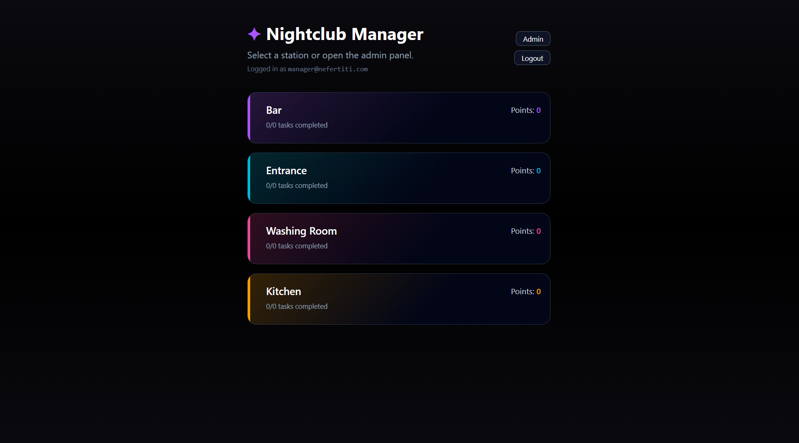
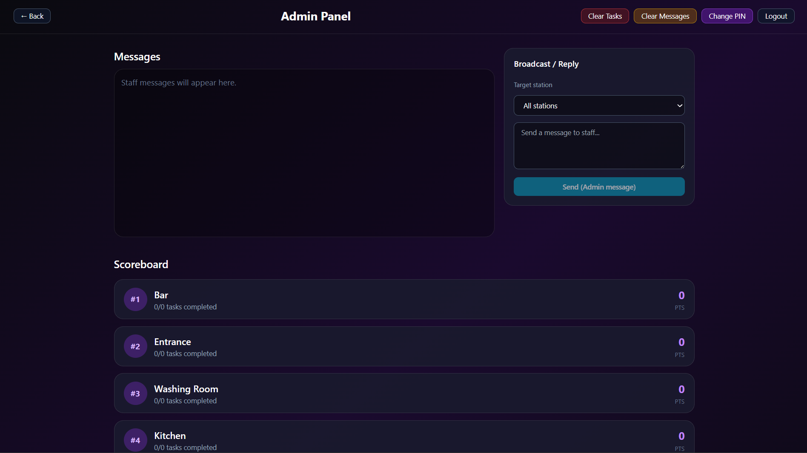
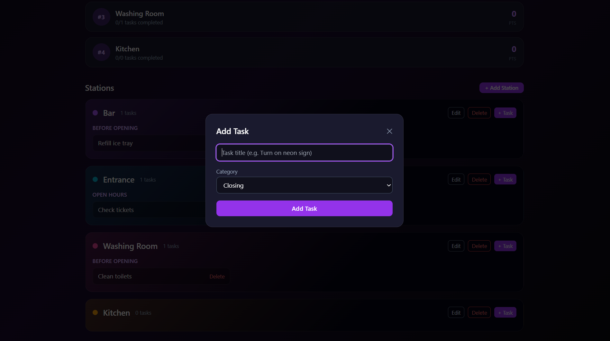
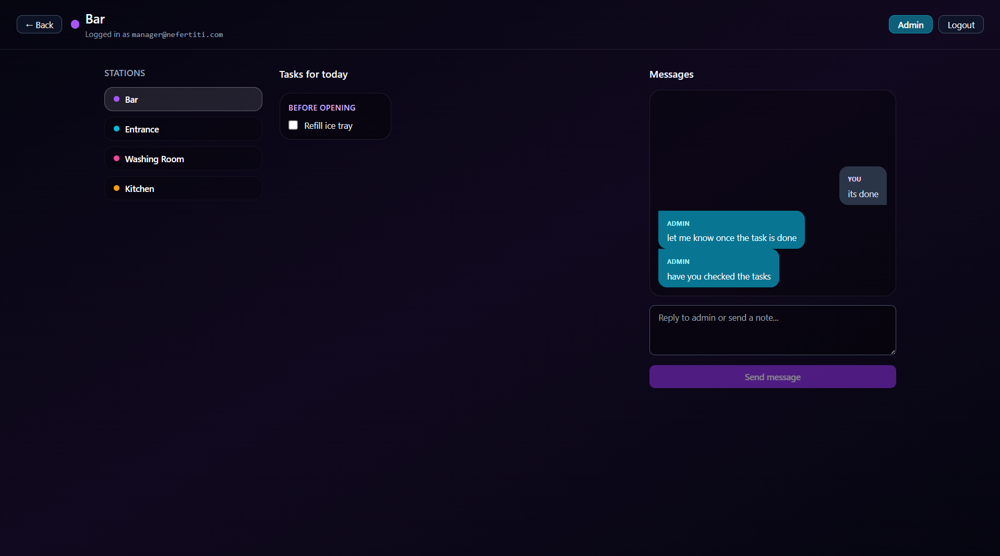
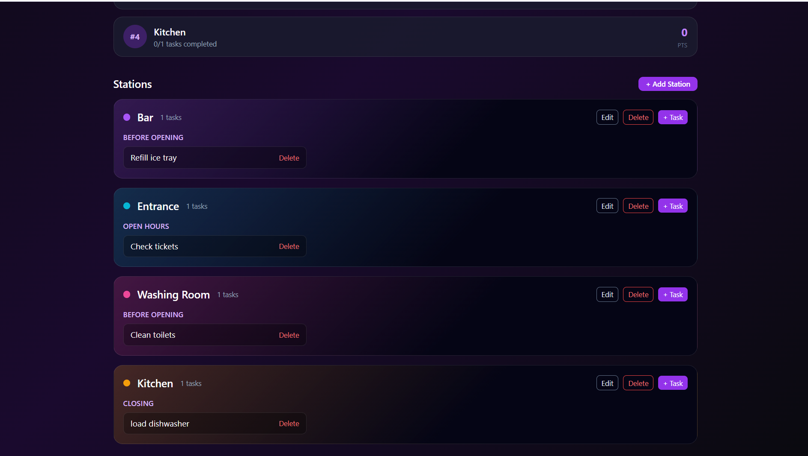

# Nightclub Task Manager

# Nefertiti-task-app

A task and communication system designed for nightclub staff operations.

Managers create stations and tasks while staff members view and complete tasks assigned to their station.  
The system also includes a messaging board for communication between staff and management.

---

## Screenshots

### Admin Panel

### Station Dashboard

### Task Management

### Messaging System

### Adim Management

---

## Key Features

### Staff

- View tasks assigned to their station
- Mark tasks as completed
- Task categories:
  - Before Opening
  - Open Hours
  - Closing
- Send messages to the admin
- View messages from management

### Admin

- Create and manage stations
- Create and assign tasks
- Broadcast messages to all stations or specific ones
- Clear messages
- Reset tasks for a new shift
- Workspace admin PIN protection

---

## Architecture

The application follows a **full-stack client–server architecture**.

React Frontend (Vite + Tailwind)
│
│ HTTP API
▼
Express Backend (TypeScript)
│
▼
In-Memory Database

External Services:

- Firebase Authentication

---

## Tech Stack

### Frontend

- React
- TypeScript
- Vite
- Tailwind CSS
- Firebase Authentication

### Backend

- Node.js
- Express
- TypeScript
- Zod validation

---

## Project Purpose

This project demonstrates:

- Full-stack TypeScript development
- REST API design
- Role-based task management systems
- Authentication using Firebase
- Dashboard-style UI applications
- Clean modular project structure

---

## Future Improvements

- Replace in-memory storage with PostgreSQL + Prisma
- Add WebSockets for real-time task updates
- Add activity logs and audit trails
